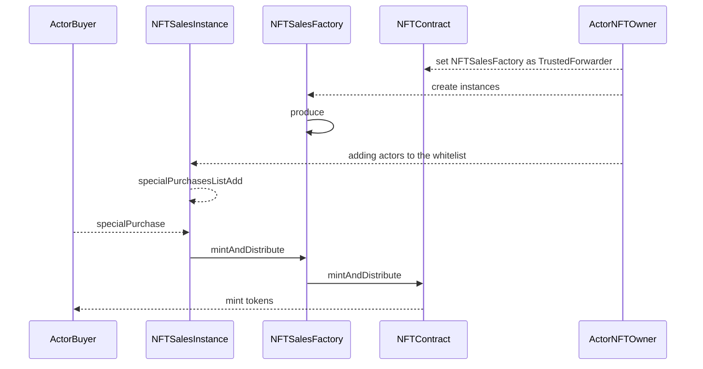

# NFTSales 
NFTSales is a contract that like extension for already deployed ERC-721 standardizes contract 
called [Gay Aliens Society (Gen 1) (GAS1)](https://etherscan.io/token/0x626a67477d2dca67cac6d8133f0f9daddbfea94e) which have realization ([EIP-2771](https://eips.ethereum.org/EIPS/eip-2771)) protocol.   

The main goal are:   
- Connection with original Gay Aliens NFT smart contract on Ethereum 0x626a67477d2dca67cac6d8133f0f9daddbfea94e
-   Ability to purchase and mint multiple NFTs in the same transaction, as long as the user has enough gas.
-   Ability to transfer ownership of this smart contract
-   Ability for the owner of the smart contract to manage the whitelist of who can use the Sales contract to mint NFTs from the connected NFT smart contract.
-   If there is a staking interval, this smart contract mints NFTs to itself as an owner, and allows the addresses in the whitelist to claim after the staking interval elapsed.

# Contracts
NFTSales represented in two contract:
- `NFTSalesFactory.sol` is a factory contract that can produce `NFTSales` by clone it from implementation.   
- `NFTSales.sol` is a template contract and ERC721 token.   

# Interactions

- First of all need to deploy NFTSalesFactory.sol. Now owners of GAS1 contract be able to produce NFTSales instances by calling method `produce` on factory.
- setup NFTSalesFactory as trusted forwarder for GAS1 contract.
- adding users into whitelist. People from the whitelist can purchase tokens

It's described at diagram below   

ActorNFTOwner can prevent works instances in any time by:
- removing NFTSalesFactory from TrustedForwarder. All instances(lined with this nft contract) will stop working.
- removing certain NFTSaleInstance from NFTSalesFactory by calling `removeFromWhiteList(address instance)`

Also ActorNFTOwner can remove user from whitelist in NFTSaleInstance by calling `specialPurchasesListRemove(address[] memory addresses)` or `mintWhitelistRemove(uint64 seriesId, address[] memory addresses)`. From common whitelist and whitelist for autogeneration tokenIds respectively
